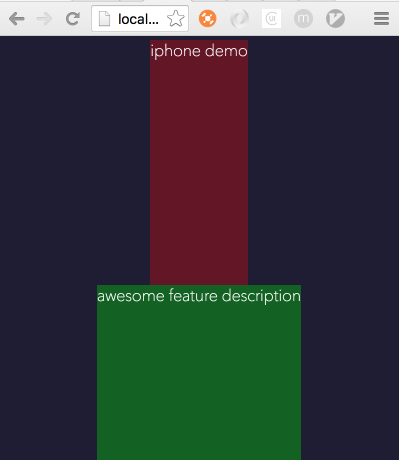
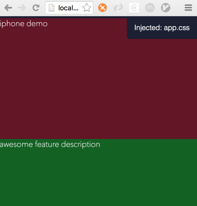
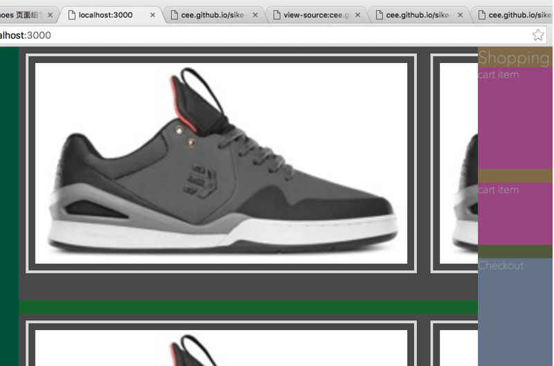
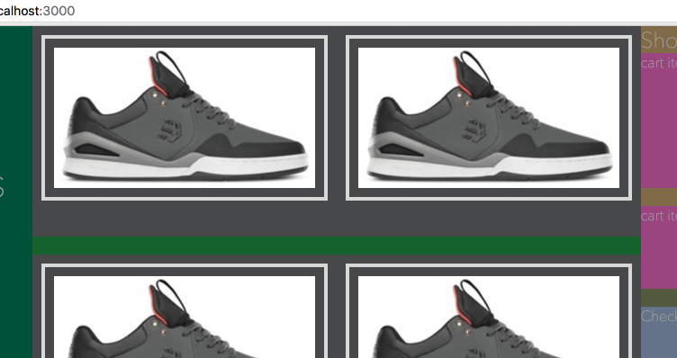

# Sike React Note

Learn react in [sike.io](http://sike.io/).

## Note

### Project 1 - I Love React

五个任务：

1. 初始化一个前端项目
1. FlexBox 布局
1. 绝对定位
1. JavaScript Bling Bling
1. ScrollMagic

响应式设计是什么，用电梯来比喻：当屏幕（电梯）的大小改变的时候，里面的物件重新排列，从而 "觉得舒服"。

响应式设计方法：

1. 网格系统 
1. 整版设计 (现在流行)

#### 1. 初始化一个前端项目

从 node 官网下载 node 安装包安装，将会同时安装最新版的 node 和 npm。

创建一个新项目，`npm init`，推送到 github gh-pages 分支。

使用 BrowserSync 实时编辑 (关键是这货在本地还可以启动一个 http server 吧):

    $ npm install browser-sync@2.9.3 --save -d
    $ npm ls
    $ ./node_modules/.bin/browser-sync —help
    $ ./node_modules/.bin/browser-sync start —server —files=index.html
    $ vim Makefile

    .PHONY: server
    server:
      ./node_modules/.bin/browser-sync start —server —files=index.html

项目 CSS 基础:

- PostCSS / autoprefixer / normalizer.css
- Flexbox 布局

PostCSS: 替代  Sass/Less。Less/Sass 的替代品之一是 PostCSS。PostCSS 不是一种语言。它是一个语法解析器，解析标准 CSS 语言。你可以通过插件来改造 CSS 语言。

    $ npm install postcss-cli@2.1.0 —save-dev

autoprefixer: autoprefixer 工具自动给你添加浏览器引擎前缀。另外，它使用一个浏览器市场占有率数据库 来决定某个特殊的特性是否仍旧需要为某个浏览器添加前缀。

    $ npm install autoprefixer@6.02. —save-dev

全局使用 Flexbox, 并使用 react native 的布局 (由上到下排列，浏览器默认是由左到右):

- 把 react native flexbox settings 复制到 css/app.css 中
- 用 postcss 将 css/app.css 转换到 bundle/app.css 中

        $ postcss —use autoprefixer css/app.css —output bundle/app.css

- 然后在 `<head>` 中链接 bundle/app.css 

引入 normalize.css:

- 先安装 normalize.css

        $ npm install —save normalize.css@3.0.3

- 再安装 postcss-import 来使用 postcss import normailize.css

        $ npm install —save-dev postcss-import@7.0.0

- 在 css/app.css 中 import normalize.css

        @import “../node_modules/normalize.css/normailize.css”;

- 运行 postcss 将 css/app.css 转成 bundle/app.css

        $ postcss —use autoprefixer —use postcss-import css/app.css —output bundle/app.css

Done 初始化一个前端项目。

#### 2. FlexBox 布局

FlexBox 是专门为现代 Web UI 设计的布局机制。它并不简单。和其他复杂的布局系统一样，使用的时候你可能会遇到出乎意料的布局结果。但是几乎所有情况下，"奇怪" 的布局行为总有一个简单的解释。

Flex 介绍: (可以和 android 的布局对照起来)

- flex-direction
- align-items
- justify-content

flex-direction: 控制子元素是水平排列还是垂直排列 (和 android LinearLayout 的 layout_orientation 类似)

    flex-direction: row / column

align-items, justify-content: 在父容器中居中元素，或者靠边 (align-items 对应 android 中的 layout_gravitey, justify-content 对应 android 中的 gravity)

    align-items: center / flex-start / ...
    justify-content: center / flex-start / ...

把 flex-direction 想象为一个箭头，指向元素布局的方向：

- justify-content - 控制着元素应该放在箭头上的什么位置。这是 flex 容器的 "主轴"。
- align-items - 控制着箭头本身应该放在容器的什么位置。这是 flex 容器的 "横轴"。(翻译成 "侧轴" 比较好，不会搞混)

align-self 可以对 FlexBox 容器中某个指定的元素的赋与不同的 align-item 值。

页面布局：实现 4 个 全屏的 section

    

    

    .section {
      height: 100vh;
    }

居中：

    .main-nav {
      alight-items: center;
      justify-content: start;
    }

练习导航：flex 的嵌套

Flex-Grow：如何拉长元素 (个人觉得，这个和 android 里的 layout_weight 类似)

你可以设置下面这两个属性使 flexbox 比它的内容更大：

- `align-self: stretch` - 沿着横轴(??)的方向拉伸元素。(align-items - 控制着箭头本身应该放在容器的什么位置。这是 flex 容器的 "横轴"。)
- `flex-grow: 1` - 沿着主轴的方向拉伸元素。

明白了! `alight-selft: stretch;`, 如果不用 stretch，默认横轴方向的大小是 `wrap_content`，这样，如果内容为空，这个 box 不可见。如下图所示：

没有用 stretch:

用了 stretch:

flex-basis:

- 我们可以使用 flex-basis 来指定计算空闲空间时 flexbox 应该是什么尺寸。如果我们给两个子元素设置了 `flex-basis: 0`，当它们的父容器计算空闲空间时，它们的宽度就好像为零一样。之后，空闲空间 (整个父容器的宽度) 才会被这两个子元素瓜分。
- flex-basis 属性就好像是 flexbox 的最小值。它决定了 flexbox 给自己保留多少空间。默认的 `flex-basis: auto` 意为 "保留尽可能多的空间来适配内容"。`flex-basis: 50px` 意为至少保留 50 像素，但是如果有更多空闲空间就会扩大。

`flex: 1`, 意为 `flex: 1 1 auto`。全写出来如下：

    flex-grow: 1;
    flex-shrink: 1;
    flex-basis: auto;

?? flex-shrink 是什么意思。看了这篇文章 - [深入理解css3中的flex-grow、flex-shrink、flex-basis](http://zhoon.github.io/css3/2014/08/23/flex.html) 明白了，这三个参数是用来分配一个 flex 容器中的剩余空间的。如果剩余空间大于 0，就使用 flex-grow 来将剩余空间分配给容器中的子元素，如果剩余空间小于 0，就使用 flex-shrink 来压缩子元素，flex-basis 则是用来计算剩余空间，如果某个子元素的 flex-basis 大于 0，意思是说在计算剩余空间时，要再减去这个值，即剩余空间至少要为这个子元素保留这么多空间。

>
1. 剩余空间＝父容器空间－子容器1.flex-basis||width - 子容器2.flex-basis||width - …
1. 如果父容器空间不够，就走压缩 flex-shrink，否则走扩张 flex-grow；
1. 如果你不希望某个容器在任何时候都不被压缩，那设置 flex-shrink:0；
1. 如果子容器的的 flex-basis 设置为 0 (width 也可以，不过 flex-basis 更符合语义)，那么计算剩余空间的时候将不会为子容器预留空间。
1. 如果子容器的的 flex-basis 设置为 auto (width 也可以，不过 flex-basis 更符合语义)，那么计算剩余空间的时候将会根据子容器内容的多少来预留空间。

web 布局与原生布局 (以 android 为例)的对比 (有对比才有更深入的理解):

- android 上的布局种类很丰富，有 LinearLayout，RelativeLayout, FrameLayout...
- 而 web 布局，基本上很单一，只有一种 `
`，类似原生布局的 LinearLayout，所以它需要借助各种 css 属性来让 div 同时实现 LinearLayout, RelativeLayout, FrameLayout。用 div 的各种嵌套来实现 android 上的 RelativeLayout。用 static/relative 来实现 RelativeLayout/FrameLayout。
- web 还有 absolute 布局，这个在 android 上用得不多。

理解它的差异和实现原理。

无论是 web 的布局，动画，还是 android ui 的布局，动画，还是像一些设计/排版软件如 (sketch, keyout)，无外乎都是那几种。

- 布局: 线性，相对，绝对
- 动画: 大小，透明度，位移，变形，rotate ...

学会举一反三。

#### 3. 绝对定位

(我的理解，绝对定位是为了实现 android 中的 RelativeLayout 和 FrameLayout)。

Static 和 Relative 的差别：一个绝对定位元素的位置是相对于该元素的父容器。`position: static` 是 CSS 的默认设定，但是它基本没有实用价值。当使用绝对定位的时候，你总应该记住把父容器设为 `positon: relative`。

    .demo-img {
      position: absolute;
      top: 91px;
      left: 24px;
    }

百分比定位: 为了实现响应式设计，你常需要使用百分比（%）来定位元素，让这些元素的位置与窗口/屏幕的大小相关。top, left 是用来定位某个元素的左上角，但在实际应用你更你往往需要定位某个元素的中心。在上面那个例子，我们要怎么用绝对定位来做居中呢? 移动元素中心的最简单方法是使用 transform 属性，按元素大小的 50% 移动它。

练习：在右下角显示机器人图标

    

      <h1>Android Is Coming</h1>
      
    

    .section-four {
      overflow: hidden;
    }

    #android-robot {
      position: absolute;
      top: 100%;
      left: 100%;
      transform: translate(-50%, -50%) rotate(-45deg);
    }

- `overflow: hidden` - 如果超出边界，容器应该把机器人隐藏。(!!! 注意，这个属性要加在父容器上)
- `rotate(-45deg)` - 旋转这个机器人。

多用 chrome 的 dev tool.

Fixed 定位：

- `position: static/absolute/relative/fixed`
- `position: fixed` 和 `position: absolute` 的行为相似。唯一的不同点在于 fixed 是相对于浏览器窗口而非父容器进行定位的。由于是相对于浏览器窗口定位，所以上下滚屏也不会改变元素在窗口中显示的位置。这样的性质对于制作 UI 导航栏和菜单栏尤为有用。

练习：滚动控制

- 使用 fixed 定位。
- 遇到问题：在没有加上 `top: 50%; right: 10px;` 这些位置属性前，slider 并没有显示出来，加上以后就好了。

加 Overlay：这里我们要说说 static 元素的另外一个坑。absolute, relative 有 z-index，static 没有 z-index。没有 z-index 的元素默认在有 z-index 的元素下面。img 和 h1 元素默认都是 `position: static`。z-index 对 static 元素不起作用，因此它们都在绝对定位的元素下面。(所以应该干脆 `* { position: relative; }`)

#### 4. JavaScript Bling Bling

使用 js 增加动画。

JS 动画 vs CSS 动画：

很多前端开发者会告诉你，你应该避免使用 JavaScript 动画。使用 CSS 动画会有更好的性能 (更少的 CPU 时间) 和更平滑的效果 (更高的帧率)。然而，JavaScript 动画慢的原因经常是因为你用的库并没有为动画进行优化。优化过的 JavaScript 动画引擎 (比如 GreenSock 或 Velocity.js) 有堪比 CSS 动画的性能。某些情况下 JS 动画甚至比 CSS 动画更快！

Js 动画的原理：使用 `setTimout()` 周期性地重绘元素。

    // 与浏览器同步重绘
    requestAnimationFrame(draw);

"Layout thrashing": <http://wilsonpage.co.uk/preventing-layout-thrashing/>

GreenSock：

    $ npm install asap@1.18.0 —save

    $ cp ./node_modules/gsap/src/uncompressed/TweenMax.js bundle/

    

TweenMax 被加载后，增加了全局 JavaScript 对象 TweenMax, TimelineMax。

使用 TweenMax 产生 css 动画。三个最重要的方法 to, from, fromTo.

`TweenMax.to(object,duration,options)` - 属性动画：由 CSS 样式表中的值变化为动画终值。

    // `#box` 元素进行 2 秒的动画
    TweenMax.to("#box",2,{
      css: {
        // 在同时更改多个 CSS 属性
        left: "200px",
        opacity: 0,
      },
    });

三种 ease 类型 (类似 android 中的 interopolar)：

- easeIn - 开始很慢，结束前加速。
- easeOut - 开始很快，接近结尾时减速。
- easeInOut - 开始很慢，中间加速，然后再次减速。

在循环动画中选择 easeInOut 会看起来更自然。

练习：让 logo 动起来。

    function animatLogo() {
      TweenMax.fromTo("#react-logo", 3, {
        css: {
          top: "-50px",
        }
      }, {
        css: {
          top: "20px",
        },

        repeat: -1,

        yoyo: true,

        ease: Power2.easeInOut,
      });
    }

渲染监控器，cool~! 在 chrome 开发者工具中。

GPU 加速：GPU 为什么比 CPU 快，因为 GPU 是并行计算 (真正的并行)，而 CPU 是串行计算。但 GPU 只能做一部分工作，比如 平移，缩放，旋转，修改透明度 这种可以一个元素上进行并行操作的计算，像 重新布局，重绘 ，同时作用在多个元素，元素间相互依赖的情况，无法进行并行操作，只能由 CPU 计算。( 我个人的理解)

你可以把一个网页想象为一堆矩形。布局和绘图都是由 CPU 完成的：

- CPU 计算这些矩形的布局。矩形在哪里？它们有多大？
- CPU 把矩形渲染成点阵位图（bitmap）。

之后如果可能的话，矩形被送到 GPU 以获得更好的性能：

- CPU 以点阵位图的形式上传到 GPU 中。
- CPU 给 GPU 发送指令去处理这些位图。可能有平移/缩放/旋转，修改透明度，等等。

GPU 可以廉价地处理 4 种动画属性：poistion, scale, rotation, opacity。

基本上只有 CSS3 transform 可以被 GPU 加速。任何盒模型属性（top, left, width, height, padding, margin, border...）都会触发重新布局和重绘。

修改代码以利用 GPU 加速：

    TweenMax.fromTo("#box",1, {
      css: {
        // 使用 CSS3 transform
        // 注意，这里不再是 left, 而是 x
        x: "-200px”, 
      }
    }

总的来说，当修改 CSS 属性时，有三种可能的开销：

- 重排（CPU。代价最高）。
- 重绘（CPU）。
- 变换, 旋转, 缩放, 透明度（GPU，代价最低）。

( 所以谨慎 重排，比如在 android 上，谨慎 `requestLayout()` ) android 上如何使用硬件加速 ??

使用 TimelineMax 实现连续动画:

    function animateRobot() {
      var t = new TimelineMax({repeat: -1});
      t.to("#android-robot", 0.4, {rotation: "-=10deg"})
        .to("#android-robot", 0.8, {rotation: "+=20deg"})
        .to("#android-robot", 0.4, {rotation: "-=10deg"});
    }

指示器 & 网页滚动器

练习：滚动事件发生时更新指示器状态

    function updateSliderControl() {
      var links = document.querySelectorAll("#slider-control a");

      for (var i = 0; i < links.length; i++) {
        var link = links[i];

        var section = document.querySelector(link.getAttribute("href"));
        var sectionTop = section.offsetTop;
        var sectionBottom = sectionTop + window.innerHeight;

        if (window.scrollY >= sectionTop && window.scrollY < sectionBottom) {
          link.className = "active";
        } else {
          link.className = "";
        }
      }
    }

    function scrollToElement(element) {
      var topOfElement = element.offsetTop;

      TweenMax.to(window, 1, {
        scrollTo: {
          y: topOfElement,
        },

        ease: Power2.easeInOut,
      });
    }

    function addSmoothScrolling() {
      var links = document.querySelectorAll("#slider-control a");

      for (var i = 0; i < links.length; i++) {
        var link = links[i];
        /*
        * error! the herf will be always the last href
        * so when you click any dot, it will scroll the last section 
        link.addEventListener("click", function(event) {
          event.preventDefault();
          
          var href = link.getAttribute("href");
          scrollToElement(document.querySelector(href));
        });
        */

        (function(_link){
          _link.addEventListener("click", function(event) {
            event.preventDefault();

            var href = _link.getAttribute("href");
            scrollToElement(document.querySelector(href));
          });
        })(link);
      }
    }

    window.onscroll = function() {
      updateSliderControl();
    }

    window.onload = function() {
      animateLogo();
      animateRobot();
      updateSliderControl();
      addSmoothScrolling();
    };

监听整个页面的滚动事件，通过判断高度来更新指示器。

js 循环的坑!

DONE!

#### 5. ScrollMagic

一个炫技的库，玩玩就好。

- 主页: <http://scrollmagic.io/>
- demo: <http://scrollmagic.io/examples/>

触发点 (trigger) 和动画 “长度” (duration)，到达触发点时引发动画。

控制器 (Controller) & 场景 (Scene):

- 控制器等于是整个页面的滚动轴，在不同垂直区域会有场景。
- 滚动到了场景会执行该场景指定的动画效果。
- 动画效果可以用 GreenSock，Velocity.js，或者是 CSS 来驱动。
- 若要把动画效果和滚动轴绑定，GreenSock 是唯一的选择。

固定 (pinning): 一个场景可以在其滚动区域固定某个元素，停止它的滚动。

安装：

    $ npm install scrollmagic@2.0.5 —save

练习：intro-section 的背景透明度变化

    function addSrollMagicAnimation() {
      var scrollMagicController = new ScrollMagic.Controller();

      var scene1 = new ScrollMagic.Scene( {
                      triggerElement: "#intro-section", 
                      triggerHook: "onLeave",
                      duration: "100%"})
                    .setTween("#mask-gradient", {opacity: 1})
                    .addIndicators()
                    .addTo(scrollMagicController);
    };

iPhone 滚动飘移效果 / iPhone 的 pin 效果：

    // move iphone
    var moveiPhone = new ScrollMagic.Scene( {
                        triggerElement: "#native-section", 
                        triggerHook: "onEnter",
                        duration: "100%"})
                      .setTween("#iphone-overlay", {width: "50%", y: 0})
                      .addIndicators({name: "moveiPhone"})
                      .addTo(scrollMagicController);

    // pin iphone
    var piniPhone = new ScrollMagic.Scene( {
                        triggerElement: "#native-section", 
                        triggerHook: "onLeave",
                        duration: "100%"})
                      .setPin("#iphone-overlay")
                      .addIndicators({name: "piniPhone"})
                      .addTo(scrollMagicController);

响应式：略。

### Project 2 - Buy Shoes

1. Buy Shoes 网页布局
1. Buy Shoes 页面细节
1. React 化 Buy Shoes 页面
1. 模块化 JavaScript 和 CommonJS

#### 1. Buy Shoes 网页布局

BEM CSS 命名约定。

网站布局：练习，双栏显示

    

      <!-- 70% 的主要区域 -->
      

        main
      

      <!-- 30% 的侧边栏 -->
      

        right
      
 <!-- site__right-sidebar -->
    
 <!-- site -->

问题：`flex-basis: 0` 和 `flex-basis: auto` 的区别在哪里？当 `site__content` 或者 cart 中内容很多的时候，使用了 `flex-basis: auto` 的你将面临什么问题？(试验过后就明白了，`flex-basis: auto;` 不会压缩内容，`flex-basis: 0;` 会压缩内容)

商品布局，当内容过长时，`flex-wrap: wrap` 让容器划分成多行显示。

    .products {
      flex-direction: row;
      flex-wrap: wrap;
    }

固定侧边栏。给侧边栏设置 position: fixed 的属性。当一个元素是 fixed 或者是 absolute 的时候，它会被移出布局流，就好像不存在一样。有两种方式能够修复这个问题，你可以：

- 对于容器：通过增加 padding 来保留侧边栏的位置。
- 对于容器中的内容：通过增加 margin 来保留侧边栏的位置。

打断一下，上面的练习不知道该怎么实现，重新侧重看看 flexbox，[深入了解 Flexbox 伸缩盒模型](http://www.w3cplus.com/blog/666.html)，flexbox 里不再有行元素，块元素。

继续回到固定侧边栏的练习。

FUCK~~~!!!! 70% 与 30%，直接用百分比就行了，我非得用什么 `flex-grow:7; flex-grow: 3;`。

如果一个宽度永远是一个固定的百分比，那么就直用百分比，不用要什么 flex-grow 为计算。因为你如果用 flex-grow，你最终得到的百分比是要与另一个元素一起计算而来，如果另一个元素的值发生变化，或是这个元素没有了，你这个元素的宽度百分比就会发生变化，而不再是原来那个值，而如果使用一个固定的百分比值，就不会因为其它元素的变化而变化。

在练习购物车列表上下滚动时，虽然设置 了 `overflow: scroll`，但一直没有生效，cart 的内容过多，把 checkout 的内容挤掉了。看了 cee 的源码才发现这里应该加一个 `flex-basis: 0` (因为我前面没加这个)，这才理解了 flex-basis 的作用，防止内容过多把其它元素挤掉。

更好的购物车滚动列表实现。让购物车标题 sticky header，`position: fixed;` 会让该元素仅脱离父容器的文档流，不会跑到父容器以外。给 `.cart__content` 加上 margin-top 或 padding-top，给购物车标题留出空间。

总结:

- `flex-grow: 1; flex-basis: 0` 通常作为一种范式来创建一个能够充满其父元素的容器，并且能够在有大量内容填充的时候，该容器不会超过其父元素的容器大小。
- 使用 perfect-scrollbar 插件是一种很好的替代浏览器内置的滚动条的方式。

#### 2. Buy Shoes 页面细节

注意：为什么 stretch 无法保持图片的原始比例的？通过下面这个算法逻辑，你将会知道如何计算图片的宽度：

- 确定原始图片本身的大小。使用原始大小计算宽高比。
- 如果明确给出了宽度 (例如 100%) 则使用给出的宽度，反之使用原始宽度。
- 调整图片高度，维持原来的宽高比。
- 将图片的宽度拉伸为容器宽度。因为 stretch 总是最后执行，它会忽略图片的宽高比。若是 stretch 在缩放前执行，那就能够保持图片的相对比例啦！

妈蛋， `flex-basis: 0` 真的很重要。没有设置这个引发各种问题。

没有给 `.site__content` 加上 `flex-basis: 0` 的效果是这样的：

    .site__content {
      background-color: #18622d;
      flex-grow: 1;
      margin-left: 170px;
    }

加上了以后是这样的：

    .site__content {
      background-color: #18622d;
      flex-grow: 1;
      flex-basis: 0;
      margin-left: 170px;
    }

如何绘制圆背景：`border-radius: 50%;`

    .product__add {
      width: 60px;
      height: 60px;
      align-self: center;
      border-radius: 50%;
      align-items: center;
      justify-content: center;

      background-color: rgb(216,216,216);
      margin-top: 20px;
    }

再次体会 absolute/fixed 的区别。把 价格 固定在每个鞋的展示框的右上角，要用 absolute, 而不是 fixed。fixed 是针对整个窗口来说的。

    .product__price {
      position: absolute;
      right: 20px;
      top: 20px;
      font-size: 24px;
      color: black;
      font-family: AvenirNext-DemiBold;
    }

指定为 fixed position 后，如果没有显示出来，尝试加上 right, left, top, bottom, z-index 这些值。

后面的就没遇到什么困难了。

响应式： `@media (max-width: 950px) {}`

通过给 某个元素增加删除 class 来实现 toggle 效果。

总结

- 将图片的宽度设置为 100% 来填充容器，同时也能保持它的宽高比。
- 使用百分比将容器划分为多个部分。
- 通过不断减小窗口大小来调整响应式布局。

#### 3. React 化 Buy Shoes 页面

终于进入到 React 的部分了

页面刷新和 Virtual DOM。有了 React，你就可以感受到客户端部分编程的简洁性 - 好像总是在做整个页面的刷新，却又能够高效快捷地直接操控 DOM 元素。

使用 Babel 编译 ES6 和 JSX。Babel 是一个 ES6 编译器。

- 记住永远使用 let 替代 var。
- 记住永远使用 => 替代匿名函数。
- 使用  class 语法。

安装 babel：

    $ npm install babel@5.8.23 —save-dev

从 React Virtual DOM 开始

    $ npm install react@0.13.3 —save-dev

JSX 是一个从 HTML 到 `React.createElement` 调用的简单映射。第一个参数是元素的类型，第二个参数是属性映射的集合。可以简化写法。JSX 有点像其他的传统模版语言。但是事实上，JSX 只是包含 Virtual DOM API 的一个简单的语法糖，它包含了一个完全不一样的编程模型。Virtual DOM 可被看作为包含 JavaScript 元素的一棵树。构建 Virtual DOM 会带来很多的便捷性。

    let App = React.createClass({
      renderTitle() {
        return (
          <h1>Buy Some Shoes!!!</h1>
        );
      },

      render() {
        let titles = [1,2,3].map(this.renderTitle);

        return (
          

            {titles}
          

        );
      },
    });

练习: 创建 App 组件

创建 Makefile：

    $ make all (cool~~)

    // Makefile
    .PHONY: all
    all:
    (make css & make js & make server & wait)

React 组件：如果一个 UI 元素被复用，那么它应该变成一个组件。`.cart-item` 和 `.product`。那些容纳元素列表的容器应当变成一个组件，`.products` 是一个容纳 `.product` 组件的容器，本身也应当时一个组件。如果一个组件过于庞大或者复杂，你应该把它拆分成几个小的子组件。你应该尝试着将 render 方法保持在 50 到 80 行左右。

React 化 App。

练习：App 决定了布局

坑之一，命名组件必须用双驼峰法，不能单驼峰。比如
 
    let SiteMain = React.createClass({   //!!!! 不能命名成 siteMain，本来 siteMain 这种命名是不合理的，但无意中触发了这个坑。
      render() {
        return (
          

            

            

            

            

          

        );
      }
    });

组件化 product

… 看到现在，这个 react 的组件化跟服务器端用 rails 的组件化的原理差不多啊，只不过把逻辑从服务器搬到了客户端。可能性能上有优势? 用了 diff? (!!! 完全不一样好嘛)

再打断一下，看一些 react 的基础知识，[一看就懂的ReactJs入门教程-精华版](http://www.cnblogs.com/yunfeifei/p/4486125.html)，(所谓的 react 组件化，对应到 android 上不就是自定义控件的一种吗，组合控件。android 写 xml 也可以像以前写 html 一样，所有控件都堆在一个 xml 里，也可以像我写 pyro 一样，只有有重复的布局，全部封装成控件。) (html 就是太散了，一个页面几乎都可以靠一个 div 来完成，所以为什么说 html 是 div+css)

- 获取属性的值用的是 `this.props.属性名`
- 创建的组件名称首字母必须大写。(!!! 原来是有规定的)
- 为元素添加 css 的 class 时，要用 className
- 组件的 style 属性的设置方式也值得注意，要写成 `style={{width: this.state.witdh}}`

再回来继续。

    let Products = React.createClass({
      render() {
        let productArr = [];
        for (var key in products) {
          productArr.push(<Product product={products[key]}/>);
        }

        return (
          

            {productArr}
          

        );
      }
    });

组件键值：对于包含了子元素的数组，你总是需要提供 key 属性。以避免整体刷新。

为组件加上 key 属性：

    let Products = React.createClass({
      render() {
        let productArr = [];
        for (var key in products) {
          productArr.push(<Product key={key} product={products[key]}/>);
        }

        return (
          

            {productArr}
          

        );
      }
    });

组件化购物车，done!

组件化数量控制器，done!

组件的生命周期 (是不是跟 android 里的 activity 生命周期的概念相似呢?)

使用 ref 替代 id，难道这个 ref 只能用在根结点?? 不能吧 (当然不是啦!)

DONE~!, cool, 完美。React 并不难。一定要 hold 住它。

#### 4. 模块化 JavaScript 和 CommonJS

JavaScript 生来有一些缺陷。let 修复了由 var 造成的常见问题，而 `=>` 修复了由 this 造成的常见问题。CommonJS 来将 app.js 分解为小模块。

CommonJS 不引入任何 JavaScript 的新语法。CommonJS API 只添加两个新东西：

- require - 一个用于加载模块的函数
- module.exports - 模块导出的内容

        // js/constants.js
        var pi = 3.1415926;
        var e = 2.71828;

        var secretAnswer = 42;

        module.exports = {
          pi:pi,
          e: e,
        };

该文件和一个通过 `<script>` 加载的文件有两处不同：

- 这个文件有自己的命名空间。不需要将你的代码包裹在一个闭包内。
- 有一个特殊的对象 module.exports。

使用 Webpack 打包：

    $npm install webpack@1.12.2 --save-dev
    $npm install babel-loader@5.3.3 --save-dev

原因是运行 webpack 时只指定了 `—module-bind jsx=bable`，还要加上 `—module-bind js=babel`

产生 Source Map，方便调试，在 webpack 命令上增加 `-d` 选项

压缩混淆，使用 `webpack -p` 选项

总结：

- 在本课中，我们了解了如何将一个大文件分解成模块。
- 每个文件都是一个 CommonJS 模块。
- CommonJS 添加了 require 和 module.exports。
- ES6 模块添加了 import 和 export 语法。
- 调用 require 函数来加载模块，传入文件的路径或者包名。
- require 使用的路径是关于调用 require 的文件的相对路径。
- 使用 Webpack 来打包 CommonJS 模块，使得可以在浏览器中运行。

### Project 3 - Use Flux in Buy Shoes

#### 开始使用 Flux

在本课中，我们将把注意力集中在 `Store->View` 上。换句话说，当我们修改应用的数据时，view 将会改变。

控制反转 (感觉在这里并不是很适合形容 Flux)

Flux 是一个事件驱动的 发布/订阅 系统 (PubSub)。广播事件。( 为什么这么多订阅系统，都是观察者模式的变体啊，还是观察者模式应用最广泛。EventBus, RxJava, Meteor …)

Flux 是单向的，一个 store 永远不更新其它 store。

(tips: 用 filter 这个高阶函数来实现 query)

两种实现：

1. MVC
1. Flux

想想 其实 MFC 的文档模型是不是也是 Flux 的思想呢。哎，其实观察者模式都长这样。

在实现这一节课的任务时，纠结在一件事情上花了很长时间，就是点击购买按钮后，我怎么在响应函数里知道对应的商品 id 呢。最后的解决办法是，其实这个商品已经作为参数传进 product 这个组件里，在 product 这个组件这个商品是成员变量，所以直接在响应函数里使用它就行了。

在此处是可以这么解决，但如果在一个组件里有多个作用相同的按钮里，该怎么办呢，看这个解决办法。<http://derpturkey.com/react-pass-value-with-onclick/> (cool~! 使用 bind 方法，可以传递额外的参数)

#### 连接 Store 和 View

做一个 JavaScript Decorator 来连接 View 和 Store，代替繁琐的重复代码。 (? React 元编程)

    @connect(FooStore,"fooData");
    class FooView extends React.Component {
      render() {
        let {fooData} = this.props;
        return 
Foo data is: {fooData}
;
      }
    }

职责分离：这句话说得好，我们重构只是为了写更少的代码

(!!! 这就是所谓的编程思想啊~!)

组件应该是「笨拙」的。它只会将参数作为输入，然后将渲染出的 UI 作为输出。

这么「笨拙」的组件看上去只依赖于输入的参数。和 Store 已经连接的组件相比，它有更好的复用性，因为可以传递任何的参数：

- 参数可以从 Store 中来。
- 参数可以从单元测试中来。
- 参数可以从其继承的父元素组件中来。

连接 Store 和 View，我们需要创建一个 wrapper 容器元素：

    class FooViewStoreWrapper extends React.Component {
      componentDidMount() {
        FooStore.addChangeListener(this.forceUpdate.bind(this));
      }

      render() {
        let fooData = FooStore.getFooData();
        return <FooView fooData={fooData}/>
      }
    }

这种约定将两个不同的职责分离到了所对应的两个组件中：

- FooView 渲染实际的视图。它并不关心参数从哪里来。
- FooViewStoreWrapper 将 Store 的数据传递给 FooView。它并不知道实际会渲染出什么 View。这种职责分离就是我们设计的奥义。当然，手动写这种 Store 的容器是一件乏味的活，所以我们想要创造 @connect 装饰器 (Decorator)

练习：实现 ConnectedStore

    // This component should re-render whenever its store emits the "change" event.
    class ConnectedStore extends React.Component {
      componentDidMount() {
        this.props.store.addChangeListener(this.forceUpdate.bind(this));
      }

      render() {
        // The `children` property is a function.
        let contentRenderFunction = this.props.children;

        // 1. Read all the data from store by calling reader methods dynamically.
        // 2. Pass the data to `contentRenderFunction`.
        let store = this.props.store;
        let propNames = this.props.propNames;
        let storeProps = {};
        propNames.map((prop) => {
        storeProps[prop] = store[prop]();
        });

        return contentRenderFunction(storeProps);
      }
    }

    let App = () => {
      let propValues = {
        currentTime: new Date(), 
        currentTick: 0
      };
      
      return (
        <ConnectedStore store={TimerStore} propNames={['currentTime', 'currentTick']}>
          { props => <TimerView {...props}/> }  // 这是个函数
        </ConnectedStore> 
      )
    }

js 中通过 字符串 找函数：

    > a=5
    5
    > a.toString()
    "5"
    > a["toString"]()
    "5"

练习：使用 ConnectedStore 重构 Cart 组件，done~!

( 但是， 虽然 Cart 和 Store 解耦了，但 CartItem 需要用到 CartStore 中的方法，还是有关联，所以这就是为什么需要 Action 的原因吗？) => 是的

练习：将 Product 组件转化成「笨拙」的组件 ( 没懂，先跳过 ) ( 哎呀，就是展示型组件啦 )

后面的也先跳过。

Action To Store PubSub With Dispatcher

action —> dispatcher  —> store/store/store… —> view/view/vew...

这个 action 其实跟 EventHub 中的一个 event 是一个意思。action/event 是自己定义的一个 object。

ation 从 view 直接发出。

总结

这一课之后，我们对 Flux 的介绍就结束了。

Flux 有两种不同的发布订阅，解决两类不同的问题：

- Store-View 发布订阅连接多个 view 和相同的数据。
- Action-Store 发布订阅把同一个 action 和多个功能连接起来。

Facebook 走到一个极端：一个 action 可以触发多个 store，而每个 store 可以触发多个 view 的更新。像 Redux 的框架则在另一个极端：一个 action 可以触发一个 store，一个 store 可以触发一个 view 的更新。尽管如此，但所有的 Flux 框架的共同点是从 action 到 store，再从 store 到 view 的单向流。(译者注：Flux 除了是一个框架，也是一种模式，Redux 是应用这种模式的一个框架）以及记住，永远 不要让 store 更新别的 store。
